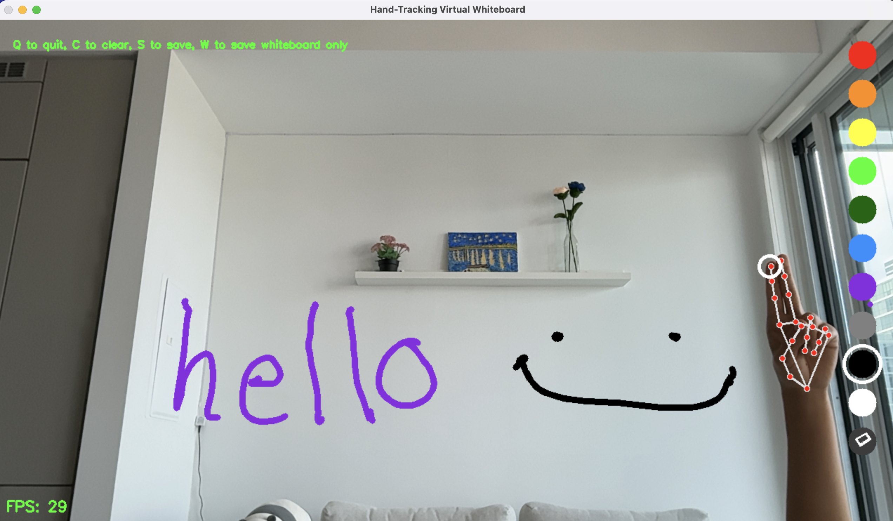
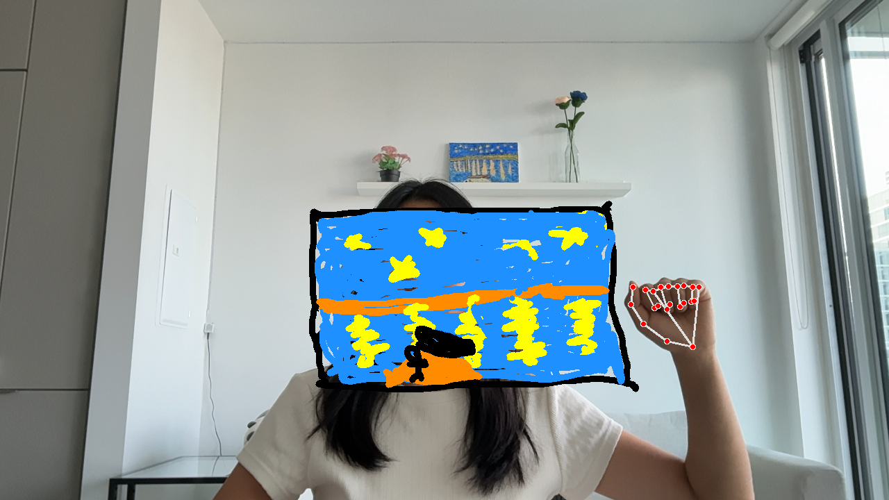
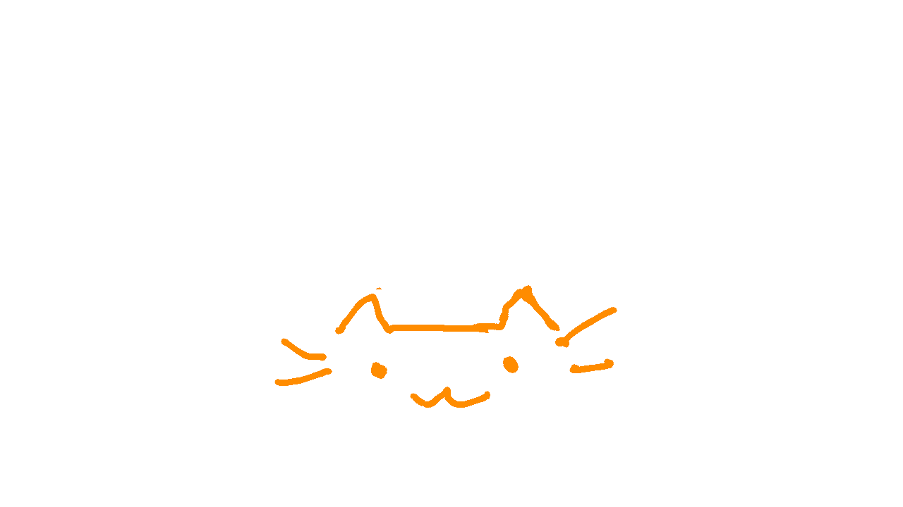

# AirScribe

A gesture-controlled virtual whiteboard, tracks your hand movements via webcam to draw in the air  




## Getting Started

### Requirements
- Python 3.9 through 3.12 (MediaPipe does not support Python 3.13 and onwards)

### Installation
1. Clone the repo
   ```
   git clone https://github.com/biancaz1/AirScribe-Virtual-Whiteboard.git
   ```
   To move into the project folder:
   ```
   cd AirScribe-Virtual-Whiteboard
   ```
3. Create a virtual environment (recommended)
   ```
   python -m venv venv
   ```
   To activate:
   * Windows:
     ```
     .\venv\Scripts\activate
     ```
   * Mac/Linux:
     ```
     source venv/bin/activate
     ```
4. Install dependencies
   ```
   pip install -r requirements.txt
   ```
5. Run
   ```
   python main.py
   ```

## Usage

### Camera
Upon starting the program, a picker window (with preview) will open if more than one camera is detected
* I/O: previous/next camera
* Enter: select the current camera
* Q: quit

### Gesture Controls
* Index finger only: draw mode &mdash; fingertip acts as a pen
* Index + middle finger: select mode &mdash; hover over colours/eraser to select
* Open palm or fist: paused &mdash; pen lifted, selection mode paused

### Keyboard Controls
* q: quit
* c: clear canvas
* s: save canvas + camera feed  
* w: save canvas only  
*Note: both save options generate uniquely timestamped filenames, so previous saves are never overwritten*
  

### Customizing
At the top of `main.py`:  
* `CAM_WIDTH / CAM_HEIGHT`: display resolution
* `SMOOTHING`: higher smoothing values reduces shakiness in lines due to unsteady hands but increases lag between your finger and pen
* `MAX_MISSED_FRAMES`: max number of consecutive frames without tracking a hand before the pen lifts
    + to avoid lines cutting off due to motion blur during quick movementse

## Troubleshooting
* **`AttributeError: module 'mediapipe' has no attribute 'solutions'`** &mdash; an incompatible mediapipe version got installed (usually
  because pip installed a newer version that removed the `solutions` API)  
  Check you're on Python 3.9 through 3.12, then run:
  ```
  pip uninstall mediapipe -y
  pip install mediapipe==0.10.21
  ```
* **No webcam window opens** &mdash; ensure that no other app is using your webcam and webcam permissions are turned on for your terminal or the app being used to run this
